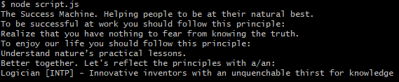

# The Success Message Machine

> The Success Message Machine generates random work and life principles to help people to be at their natural best.

## Table of contents

* [General info](#general-info)
* [Screenshots](#screenshots)
* [Technologies](#technologies)
* [Setup](#setup)
* [Features](#features)
* [Status](#status)
* [Inspiration](#inspiration)
* [Contact](#contact)

## General info

The purpose of this project is to help me to better understand the JS developer IDE and to inspire people with valuable principles.

## Screenshots



## Technologies

* JavaScript - version ES6
* Node.js - version 12.19.0.

## Setup

Please use Node.js to run the program in your local environmnet.

## Code Examples

Examples of message building blocks:

```javascript
// Iterate over the success engine object
for(let prop in successMessages) {
let index = generateRandomNumber(successMessages[prop].length);
// use the object's properties to customize the message being added to personalMessages  
    switch(prop) {
      case 'workPrinciples':
           personalMessages.push("To be successful at work you should follow this principle:");
           personalMessages.push(successMessages[prop][index]);  
        break
      case 'lifePrinciples':
        personalMessages.push("To enjoy our life you should follow this principle:");
           personalMessages.push(successMessages[prop][index]);  
        break
      case 'personalityTypes':
        personalMessages.push("Better together. Let's reflect the principles with a/an:");
           personalMessages.push(successMessages[prop][index]);  
        break
      default:
        personalWisdom.push('There is not enough info.')
    }
};

```

## Features

List of features ready and TODOs for future development

* Generate work principles
* Generate life principles
* Recommend a personality type to meet

To-do list:

* Add further work and life principles
* Add further personality types
* Improve formatted output design

## Status

Project is: _finished_

## Inspiration

Thanks to Ray Dalio's and his inspiring book "Life and Work Principles"

## Contact

Created by [@pwagnerde](https://github.com/pwagnerde) - feel free to contact me!
